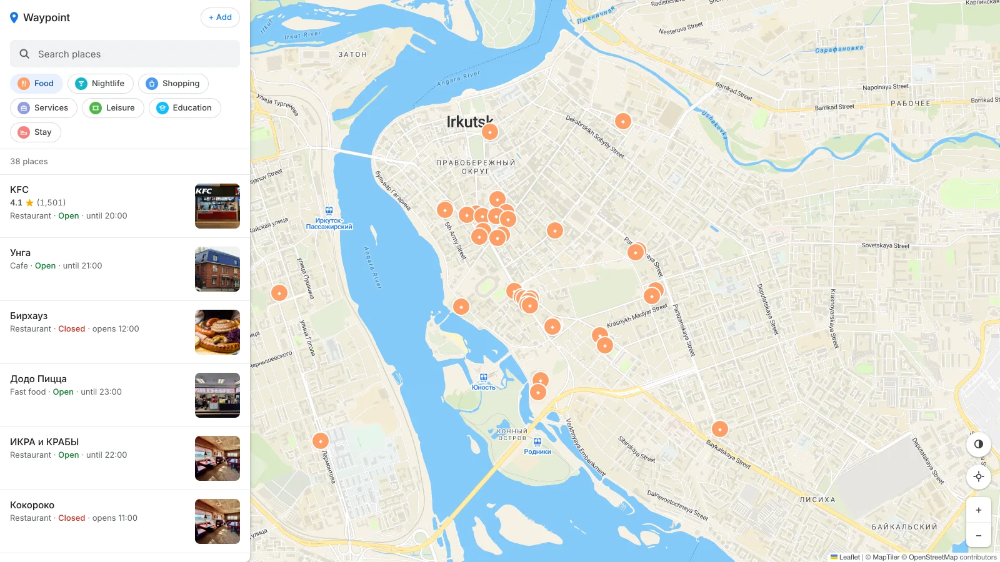
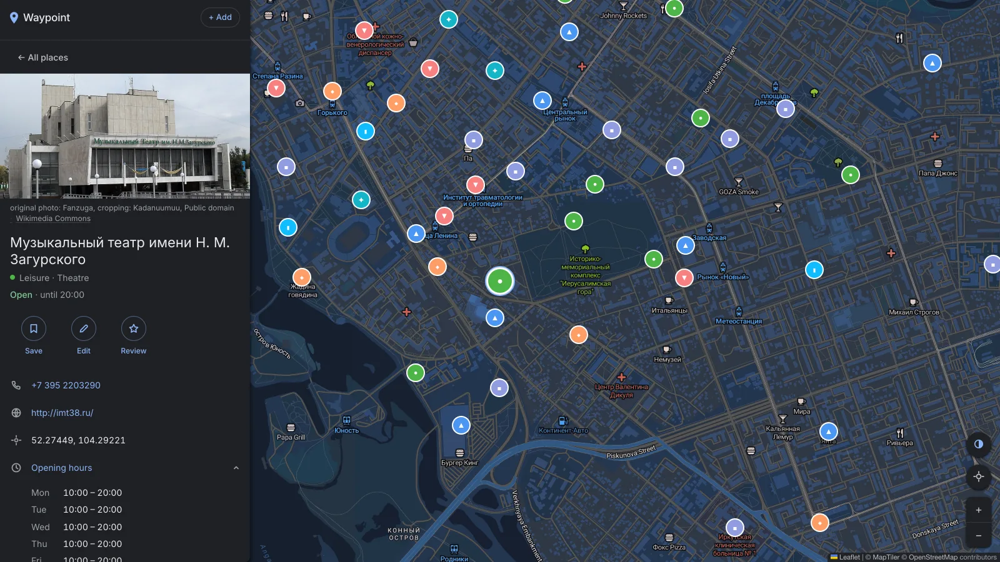

# Waypoint

A map client for exploring places in a city, built on **Leaflet** and **OpenStreetMap** data.
Search 199 places, filter by category, open one for its hours, contacts, photo and reviews. Every
tile, marker and popup is drawn by Leaflet over open data: no Google Maps key, no per-load billing,
and no routing or Street View either.

**[Live demo](https://g-maps-clone.web.app/)** · React 17 · TypeScript · Redux Toolkit · Vite · Firebase



## Running it

```bash
npm install
npm run dev      # no .env, no API keys, no Firebase account
npm run verify   # types, lint, formatting, 204 unit tests
npm run e2e      # 42 Playwright tests, against the production build
```

Out of the box the app serves the 199-place dataset in `src/data/fixtures/`, and everything except
sign-in works offline. Copy `.env.example` to `.env` for live Firestore data and the app switches
adapters on its own. The same file takes a `VITE_MAPTILER_KEY` that replaces the keyless CARTO and
Esri basemaps with MapTiler Streets; it's a public identifier, so restrict it by origin rather than
hiding it.

## Architecture

Data flows one way: **repository → RTK Query → `filterPlaces` → the panel and the marker layer**.
Both render the same list, so they can't disagree about what matched.

```
src/
  domain/      Types and pure logic: opening hours, search ranking, categories
  data/        PlacesRepository port + Firestore and fixture adapters
  app/         Store, RTK Query endpoints, UI state
  components/  Shared presentational pieces
  features/    map · places · search · auth · saved
```

- **Two repositories, one interface.** `src/data/index.ts` picks Firestore or fixtures at runtime, so
  the app runs from `git clone` with no credentials and tests exercise real code paths rather than
  mocked SDK calls.
- **Search runs over the whole dataset on every keystroke,** so the input updates immediately and the
  results catch up a frame later. `filterPlaces` ranks exact name, then prefix, then substring, which
  is why "sub" finds Subway rather than Sberbank.
- **Query, chips and open place go into `?q=`, `?cat=` and `?place=`** with `replaceState`, so a view
  can be linked without typing burying the back button.
- **Components never touch Firebase,** and the domain layer imports neither React nor Firebase.
- **The legacy adapter is an anti-corruption layer** (`src/data/normalise.ts`): 2021 data split
  across two drifted collections, placeholders saved as values (`"Add website"`), free-text hours
  with typos like `"10;00"`, coordinates as either a GeoPoint or a `[lat, lng]` array. The old client
  flattened both with `Object.values()`; missing that handed Leaflet `(undefined, undefined)` and
  took the map down. Now explicit, and pinned by a test.

## The data

19 places were entered by hand and carry the ratings. `scripts/import-osm.mjs` adds 180 more from
Overpass, cut from 3,666 candidates by how well known a place is rather than how complete its record
is, since completeness measures the mapper and not the place. Caps on top: no kind above a fifteenth
of the map, no chain above two branches. Opening hours are parsed from the OSM syntax
(`Mo-Fr 08:00-13:00; Su off`) and rejected rather than approximated when they don't fit; imported
places get no rating, since inventing one would make every other number suspect.
`scripts/curate.mjs` re-checks the inherited rows on every import — they held a park in Panama that
stretched the map across two continents — and `src/data/fixtures.test.ts` fails if any of it returns.

**94 of 199 places, 47%, show a photograph;** the rest draw their category mark.
`scripts/import-photos.mjs` fills them in order of how much each source is a picture of the place
itself:

| Source                                                                    | Places |
| ------------------------------------------------------------------------- | ------ |
| The place's own OSM tags (`image`, `wikimedia_commons`, `wikidata` → P18) | 19     |
| The place's own website (`og:image`)                                      | 18     |
| Nearest geotagged Commons/Wikidata photo within 50 m                      | 0      |
| Stock photo of the place's type                                           | 52     |
| Entered by hand along with the place                                      | 5      |

The app may show borrowed data, but it must not present it as something it isn't. At a 150 m radius
coverage hit 81%, filled out with a sunset over the embankment on a burger place: a real photo,
labelled with its distance, and still reading as a bug. So portraits travel only 25 m, no photo is
used more than twice, and stock covers say _Generic photo, not of this place_ above the credit.
Author, licence and file page travel with each picture, or the domain for a cover off a business's
own site, which states no author. Every cover is fetched before it ships and dropped if it isn't an
image, because a dead link counts as covered and never gets replaced.

## The map layer

Leaflet is driven directly rather than through `react-leaflet` — one dependency fewer, and the
imperative code stays in `useMarkerLayer.ts`:

- **A crowd is thinned, not collapsed** into numbered bubbles. Every place gets the zoom at which it
  first appears, so the most prominent one in a neighbourhood is drawn alone and its neighbours wait
  until zooming in makes room. Prominence stands in for the popularity data this map lacks: rating
  first, then record completeness. Below 60 results thinning is off, so a filtered list reads
  literally.
- **Only what's on screen exists,** and markers are diffed by key: panning touches only the pins that
  entered or left, and changing the selection repaints two icons.
- **Pins are `divIcon`s** — no sprite, no broken icon paths. Leaflet forwards `alt` only for image
  icons, so the accessible name goes into the icon markup, escaped as third-party data.

Not MapLibre: measured rather than assumed, Leaflet with DOM markers stays under one frame up to
about 1,000 pins, while MapLibre costs five times the bundle, needs a vector tile source where the
basemap here is one URL template, and needs WebGL, which headless CI doesn't reliably have.



## Writing and testing

Adding, correcting and reviewing a place all happen in the panel, in the column the list came from;
a modal over the map would cover the thing the form is about. It works with no backend, since the
fixture repository implements the same write methods against `localStorage`. You place a pin by
moving the map under a crosshair rather than dragging a marker, because on a phone your thumb covers
the marker exactly when you need to see it. Mutations patch the RTK Query cache instead of
invalidating it, which would re-read the whole collection for one row already in hand.

204 unit tests cover the domain logic, the import scripts and the app; 42 Playwright tests cover the
map on desktop and mobile viewports in CI. Leaflet is stubbed in jsdom — it needs real layout and a
real canvas, and a test that mocks both proves nothing — so it's checked against the production
build instead.

## Security model

`firestore.rules` lives in the repository and CI deploys it before the app itself, so a release can't
go out assuming an access model that failed to land.

| Path                       | Read   | Write                                           |
| -------------------------- | ------ | ----------------------------------------------- |
| `places/{id}`              | anyone | its author, or anyone signed in if it has none  |
| `places/{id}/reviews/{id}` | anyone | anyone signed in; never edited or deleted after |
| `users/{uid}`              | owner  | owner, shape-validated, list capped at 500      |

A place with no author — all 180 imported from OSM — is community-maintained. A review and the
place's average are written in one transaction; the rules check that the count rose by one and the
average stayed in range, but can't recompute it without reading every review, which would need a
Cloud Function and a billing plan this project doesn't use. A cover is a link rather than an upload,
held to `https://` and 500 characters, and any credit a browser writes is refused. The previous
revision shipped no rules file at all, leaving every collection world-writable.

## Numbers

7 runtime dependencies, down from 40. ~3,900 lines of application code, down from ~9,600, for a wider
feature set. ~148 kB gzipped initial JavaScript; the dataset (~22 kB) and the Firebase SDK are both
dynamically imported, and a fixtures build never fetches the SDK at all. First contentful paint
~85 ms and pins on screen ~105 ms locally; throttled to a quarter of the CPU on simulated fast 3G,
pins are there in 1.5 s and the last tile lands at 4.3 s.

## History and licence

Started in July 2021 as `google-maps-clone`, a close visual copy of Google Maps, tagged
**[`v0.1-google-maps-clone`](../../tree/v0.1-google-maps-clone)**. The rewrite kept the idea and the
dataset and replaced everything else; what's left of the resemblance is the palette and the shape of
the furniture.

MIT. Place and map data © OpenStreetMap contributors
([ODbL](https://www.openstreetmap.org/copyright)); tiles ©
[MapTiler](https://www.maptiler.com/copyright/) with a key, © CARTO / © Esri, HERE, Garmin without
one. Photographs are © their authors, via [Wikimedia Commons](https://commons.wikimedia.org/) under
each file's own licence or published by the places themselves.
