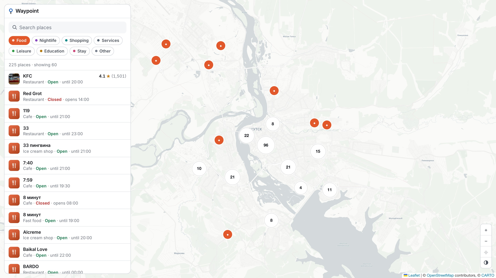
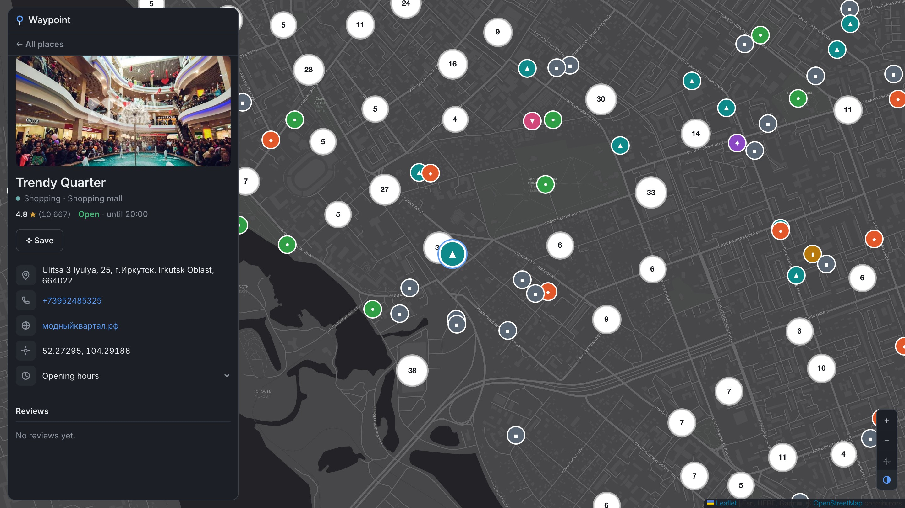

# Waypoint

A map client for exploring points of interest, built on **Leaflet** and **OpenStreetMap** data.
Search 1,600 places across a city, filter by category, and open one to see its hours, contact
details and reviews.

**[Live demo](https://g-maps-clone.web.app/)** · React 17 · TypeScript · Redux Toolkit · Vite · Firebase



---

## Why not the Google Maps API

Every tile, marker, popup and control on screen is rendered by Leaflet against open data.
Nothing here is an embedded Google map, and that was the point of building it:

- **No vendor lock-in.** The basemap is a URL template. Switching from CARTO to Stadia, to a
  self-hosted tile server, or to raw OSM tiles is one environment variable. The light/dark
  control on the map is the same idea with two of them.
- **No metered API.** The Google Maps JavaScript API bills per map load. This runs on tiles that
  cost nothing at this scale, so a demo can stay online indefinitely.
- **Control over rendering.** Markers are DOM elements styled with the same CSS as the rest of the
  interface, so the map is part of the design rather than an iframe with its own opinions — each
  pin carries its category's colour, so the map is legible by kind and not just by position.

The trade is real and worth stating: there is no routing, no Street View, and no places database.
For a viewer over a dataset you own, none of those are needed.

## Running it

```bash
npm install
npm run dev
```

That is the whole setup. **No `.env`, no API keys, no Firebase account.** With no configuration
the app serves the 1,620-place dataset bundled in `src/data/fixtures/`, and every feature except
sign-in works offline.

To read live data from Firestore instead, copy `.env.example` to `.env` and fill it in. The app
switches adapters on its own; nothing else changes.

```bash
npm run verify   # types, lint, formatting, unit tests
npm run e2e      # Playwright, against the production build
```

## How it is put together

```
src/
  domain/      Types and pure logic — opening hours, search ranking, categories
  data/        PlacesRepository port + Firestore and fixture adapters
  app/         Store, RTK Query endpoints, UI state
  features/    map · places · search · auth · saved
```

Data flows one way: **repository → RTK Query → selector → component**. Components never touch
Firebase, and the domain layer imports neither React nor Firebase, so the logic that is easy to
get subtly wrong is testable in isolation.

### The repository port

`PlacesRepository` is three methods. Two implementations satisfy it — Firestore and fixtures —
and `src/data/index.ts` picks one at runtime based on whether Firebase is configured.

Two things fall out of that. Reviewers get a working app from `git clone` with no credentials,
and the test suite runs against real code paths rather than mocked SDK calls. It also means the
backend is a replaceable part: adding a Postgres or Supabase adapter is a new file implementing
the same interface, not a rewrite.

### Reading a schema you inherited

The Firestore adapter is an anti-corruption layer, not a `map()`. The data behind this app was
written by an earlier version of it in 2021, and it shows:

- Place data is split across two collections that have since **drifted apart** — each holds rows
  the other lacks. The adapter reads the union and merges by document id.
- The old editor **saved its own input placeholders** as real values, so `"Add website"` is an
  absent field rather than a website.
- Opening times were free text and contain typos such as `"10;00"`.
- Coordinates exist in **two different shapes** — most rows hold a GeoPoint, a couple hold a
  plain `[lat, lng]` array. The old client read both with `Object.values()`, which flattened them
  by accident; missing this on the rewrite handed Leaflet `(undefined, undefined)` and took the
  whole map down. It is now explicit, and pinned by a test.

All of that lives in `src/data/normalise.ts`. None of it reaches a component.

### Where the data comes from

The twenty hand-entered places carry the photos, ratings and reviews. The rest of the map — 1,600
cafés, shops, clinics, schools and hotels — is imported from OpenStreetMap by
`scripts/import-osm.mjs`, which queries Overpass, maps OSM tags on to the app's own types, and
rewrites the fixture. Re-running it leaves the hand-entered rows alone.

Two decisions in there are worth naming:

- **Opening hours are parsed, not passed through.** OSM stores them as a small language
  (`Mo-Fr 08:00-13:00,14:00-20:00; Su off`). `scripts/opening-hours.mjs` reads the subset this
  app can represent and **rejects the rest** rather than approximating it — a place whose hours
  cannot be stated exactly shows none. It has its own test suite.
- **The city's mix is preserved.** Trimming 3,600 candidates to 1,600 by data quality alone would
  have handed the map to whoever fills in their phone number: shops would have grown from 48% of
  the city to 57%, and schools would have all but disappeared. Each kind keeps its share of the
  budget and competes only against its own kind.

Ratings are left empty on imported places. OSM has none, and inventing them would make every
other number in the app suspect.

### The map layer

Leaflet is driven directly rather than through `react-leaflet`:

- **Only what is on screen exists.** [Supercluster](https://github.com/mapbox/supercluster)
  answers with the clusters and loose pins for the current viewport, so the DOM holds ~60 markers
  instead of 1,620. Below 60 results clustering switches off entirely — a filtered list should
  read literally, five results and five pins.
- **Markers are diffed by key.** Panning touches only the pins that entered or left the viewport;
  changing the selection repaints exactly two icons rather than rebuilding the layer.
- **The map's lifetime follows its DOM node,** via a ref callback with a cleanup function, not an
  effect that has to synchronise state on mount.
- **Pins are `divIcon`s,** so there is no image sprite to bundle, no broken icon paths, and the
  markers are styled from the same CSS as everything else. Leaflet only forwards its `alt` option
  to image icons, so the accessible name is written into the icon markup instead — with the place
  name escaped, because it is third-party data.

One dependency fewer than `react-leaflet`, and the imperative/declarative boundary sits in one
file (`useMarkerLayer.ts`) instead of being spread across components.

### Why not MapLibre

MapLibre GL renders on the GPU and would hold ten times this dataset without clustering at all.
It was measured rather than assumed: **Leaflet with DOM markers stays under one frame up to about
1,000 pins**, and past that the fix is to draw fewer of them, not to draw them faster. Clustering
supplies that, and it is a legibility requirement before it is a performance one — 1,620 pins over
one city is unreadable however fast it paints.

Against that, MapLibre costs roughly five times the bundle, needs a vector tile source (the
key-free raster basemap here is one URL template), and needs WebGL — which headless CI does not
reliably have. The trade only starts paying at tens of thousands of points, or when the map needs
tilt, rotation or data-driven styling. None of that is on this map.



## Testing

| Layer   | Tool                     | What it covers                                                                        |
| ------- | ------------------------ | ------------------------------------------------------------------------------------- |
| Domain  | Jest                   | Opening hours across midnight, search ranking, category mapping, schema normalisation |
| Import  | Jest                   | The OSM opening-hours grammar, including what it refuses to parse                     |
| App     | Jest + Testing Library | Filtering, selection, deep links, saved places, load failures                         |
| Browser | Playwright               | Leaflet actually rendering, clustering, marker/list sync, mobile sheet                |

68 unit tests and 24 browser tests, run on desktop and mobile viewports in CI.

The map is stubbed in the jsdom tests — Leaflet needs real layout and a real canvas, and a test
that mocks all of that proves nothing. Playwright covers it against the production build instead.

## Security model

`firestore.rules` and `storage.rules` are in the repository, reviewed like any other change, and
deployed by CI on every push to `master` — before the app itself, so a release cannot go out
assuming an access model that failed to land. What is committed here is what the database
enforces.

| Collection                           | Read   | Write                                      |
| ------------------------------------ | ------ | ------------------------------------------ |
| `places`, `descriptions`, `comments` | anyone | nobody                                     |
| `users/{uid}`                        | owner  | owner, shape-validated, list capped at 500 |

Reference data is maintained out-of-band and is immutable from a browser. Signing in does not
unlock editing anything; it carries a saved list, which lives in `localStorage` when signed out
and merges into the user's document on sign-in.

> The previous revision shipped **no rules file at all**, which left every collection
> world-writable by anyone who found the endpoint.

## Notes on the numbers

- 8 runtime dependencies, down from 40. The removed set included `sharp`, `firebase-admin` and
  `firebase-functions` — server-side packages that were never imported — and `node-sass`, which
  made `npm install` fail on any Node newer than 16.
- ~3,100 lines of application code, down from ~10,900, for a wider feature set.
- 142 kB gzipped initial JavaScript. The dataset (100 kB gzipped) and the Firebase SDK are both
  dynamically imported; a fixtures build never fetches the SDK at all.
- First contentful paint 84 ms, pins on screen 143 ms, 10 MB heap. Throttled to a quarter of the
  CPU on a simulated fast-3G connection, the map is complete in 2.5 s — network-bound, not
  compute-bound. The heaviest interaction measured, clearing a search and putting all 1,620
  places back, takes 48 ms; Chrome's threshold for a responsive interaction is 200 ms.

## What is next

Place editing — create and edit a place, drag its pin, upload a cover photo, post a review — as a
single schema-driven form rather than the five separate modals the old version used. That work
extends the rules above with authenticated, owner-scoped writes.

## History

This repository began in July 2021 as `google-maps-clone`, a deliberately close visual copy of
Google Maps. That version is tagged **[`v0.1-google-maps-clone`](../../tree/v0.1-google-maps-clone)**
and its commits are still in the history.

The rewrite kept the idea and the dataset and replaced everything else — including the interface,
because a faithful copy of Google Maps reads as an embedded Google map no matter who wrote it.

## Licence

MIT. Place data and map data © OpenStreetMap contributors ([ODbL](https://www.openstreetmap.org/copyright)),
light tiles © CARTO, dark tiles © Esri, HERE, Garmin.
